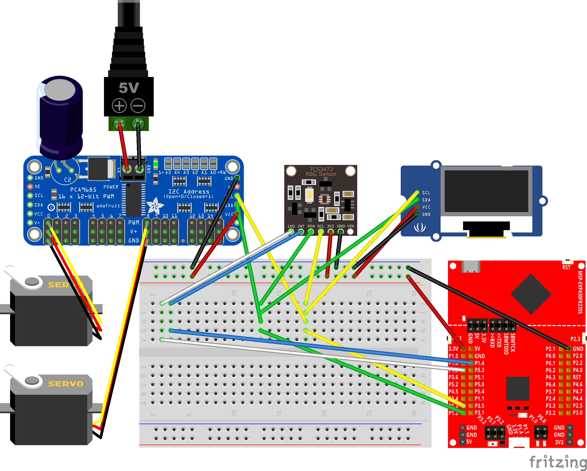
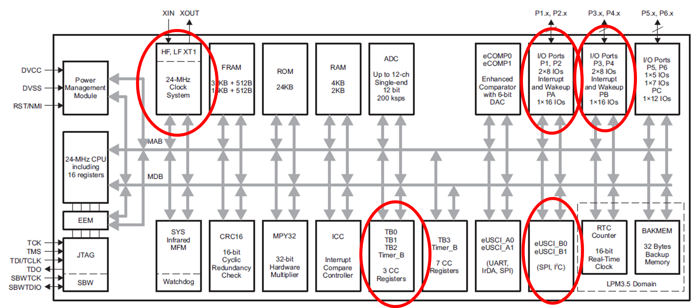

# Sortiermaschinen-Projekt

Dieses Projekt implementiert eine automatisierte Sortiermaschine unter Verwendung des MSP430FR2355. Das System wurde entwickelt, um Objekte (Medikamente) basierend auf ihrer Farbe mithilfe eines Farbsensors und einer servogesteuertern Kippplatform zu sortieren.

## Systemarchitektur


Das System besteht aus folgenden Hauptkomponenten:
- **MSP430FR2355 Launchpad**: Mikrocontroller
- **TCS34725 Farbsensor**: RGB-Farberkennung zur Objektidentifikation
- **PCA9685 Servotreiber**: PWM-Controller für Servomotoren
- **LCD1602 Display**: Statusanzeige für System-Feedback
- **Servomotoren**: Aktoren für die Sortierplattform

## Hardware-Implementierung



### Hauptkomponenten und Verbindungen
- **I2C-Bus-Kommunikation**: 
  - Verbindet den Farbsensor (TCS34725)
  - Steuert den Servotreiber (PCA9685)
  - Kommuniziert mit dem LCD-Display (LCD1602)
- **Servo-Plattform**: Mechanischer Sortiermechanismus, gesteuert durch Servomotoren
- **Stromversorgung**: 3.3V-Stromverteilung für alle Komponenten, 5V extra Versorgung für die Sevos

## Mikrocontroller-Peripherie



Der MSP430FR2355 nutzt folgende wichtige Peripheriekomponenten:
- **I2C-Schnittstelle**: Für die Kommunikation mit externen Geräten
- **Timer-Module**: Für Timer und Systemtick
- **GPIO-Ports**: Für allgemeine Ein-/Ausgabesteuerung
- **Taktsystem**: 1MHz Systemtakt

## Projektstruktur
```
esr25_g2_sorting-machine/
├── button/             - Button-Schnittstellenimplementierung
├── I2C/                - I2C-Kommunikationsprotokoll
├── lcd1602_display/    - LCD-Display-Treiber und Manager
├── led/                - LED-Steuerungsimplementierung
├── PCA9685/            - Servotreiber-Controller
├── platform/           - Plattform-Steuerungslogik
├── state_machine/      - Hauptsystem-Zustandsverwaltung
├── TCS34725/           - Farbsensor-Treiber
└── timer/              - Timer-Konfigurationen
```
