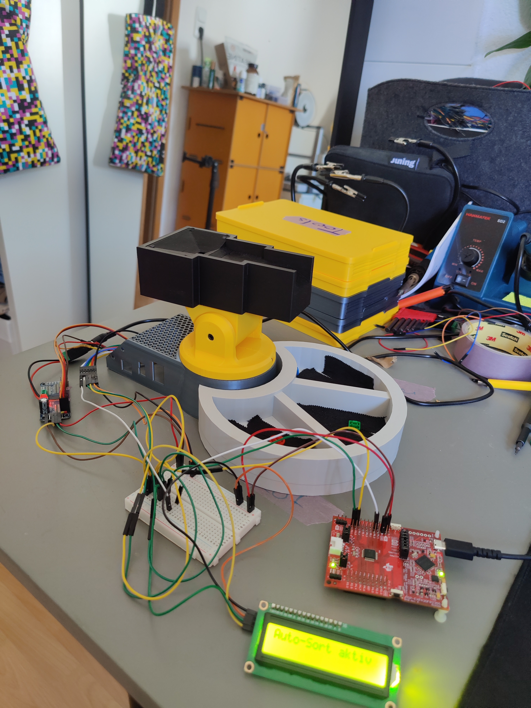
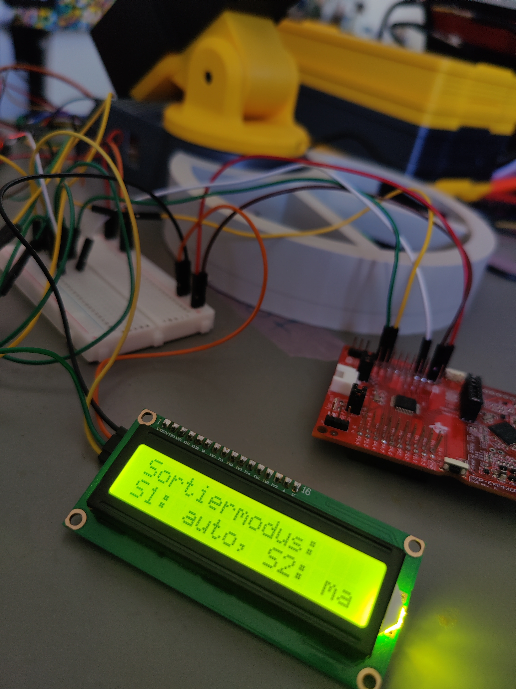
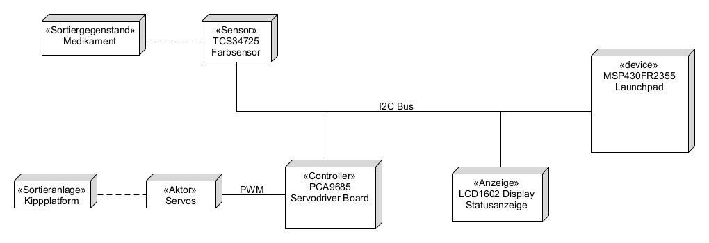
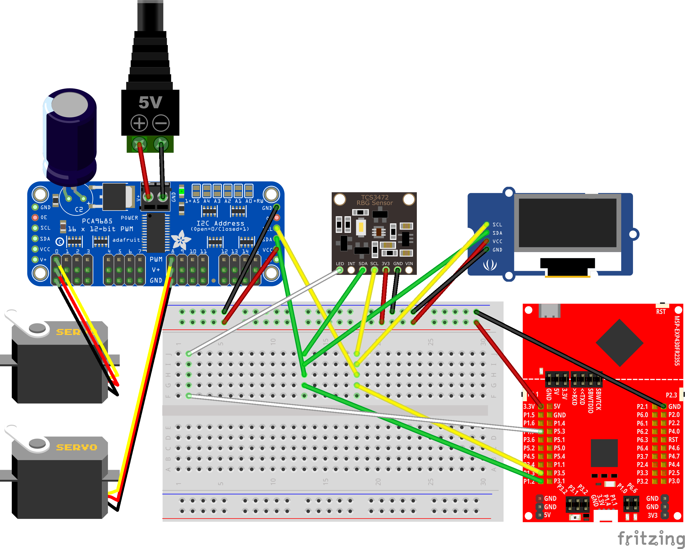

# Sortiermaschinen-Projekt

Dieses Projekt implementiert eine automatisierte Sortiermaschine unter Verwendung des MSP430FR2355. Das System wurde entwickelt, um Objekte (Medikamente) basierend auf ihrer Farbe mithilfe eines Farbsensors und einer servogesteuertern Kippplatform zu sortieren.

## Demo

Hier sind einige Bilder des fertigen Systems:

<div style="display: flex; justify-content: space-between; align-items: start; margin-bottom: 20px;">
    <div style="flex: 1;">
        
        <p><em>Komplettes System</em></p>
    </div>
    <div style="flex: 1; margin-right: 10px;">
        
        <p><em>LCD-Display - Hier Auswahl des Sortiermodus</em></p>
    </div>
    <div style="flex: 1; margin-right: 10px;">
        
        <p><em>Sortierplattform sortiert rote Pille</em></p>
    </div>
</div>

## Systemarchitektur



Das System besteht aus folgenden Hauptkomponenten:
- **MSP430FR2355 Launchpad**: Mikrocontroller
- **TCS34725 Farbsensor**: RGB-Farberkennung zur Objektidentifikation
- **PCA9685 Servotreiber**: PWM-Controller für Servomotoren
- **LCD1602 Display**: Statusanzeige für System-Feedback
- **Servomotoren**: Aktoren für die Sortierplattform

## Hardware-Implementierung



### Hauptkomponenten und Verbindungen
- **I2C-Bus-Kommunikation**: 
  - Verbindet den Farbsensor (TCS34725)
  - Steuert den Servotreiber (PCA9685)
  - Kommuniziert mit dem LCD-Display (LCD1602)
- **Servo-Plattform**: Mechanischer Sortiermechanismus, gesteuert durch Servomotoren
- **Stromversorgung**: 3.3V-Stromverteilung für alle Komponenten, 5V extra Versorgung für die Sevos

## Mikrocontroller-Peripherie


Der MSP430FR2355 nutzt folgende wichtige Peripheriekomponenten:
- **I2C-Schnittstelle**: Für die Kommunikation mit TCS, PCA und LCD
- **Timer-Module**: Für Timer, Systemtick und button debouncing
- **GPIO-Ports**: Für allgemeine Ein-/Ausgabesteuerung
- **Taktsystem**: 1MHz Systemtakt

## Projektstruktur
```
esr25_g2_sorting-machine/
├── button/             - Button-Schnittstellenimplementierung
├── I2C/                - I2C-Kommunikationsprotokoll
├── lcd1602_display/    - LCD-Display-Treiber und Manager
├── led/                - LED-Steuerungsimplementierung
├── PCA9685/            - Servotreiber-Controller
├── platform/           - Plattform-Steuerungslogik
├── state_machine/      - Hauptsystem-Zustandsverwaltung
├── TCS34725/           - Farbsensor-Treiber
└── timer/              - Timer-Konfigurationen
```

## Dokumentation generieren

Das Projekt verwendet Doxygen zur Dokumentationsgenerierung. Um die Dokumentation zu erstellen:

1. Stellen Sie sicher, dass [Doxygen](https://www.doxygen.nl/download.html) installiert ist
2. Führen Sie das Script `generate_docs.bat` aus
3. Die generierte Dokumentation finden Sie unter `docs/html/index.html`

Das Script wird automatisch:
- Die Doxygen Awesome CSS Theme herunterladen (falls nicht vorhanden)
- Die alte Dokumentation löschen
- Neue Dokumentation generieren
- Die Dokumentation im Browser öffnen

Die Dokumentation enthält:
- Detaillierte API-Beschreibungen
- Funktionsreferenzen
- Architekturdiagramme
- Hardwareverbindungen
- Beispielbilder des Systems
